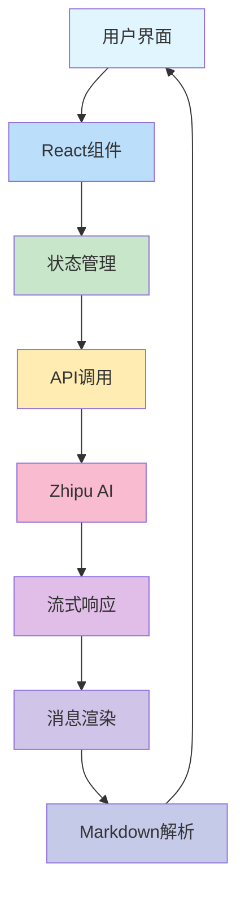
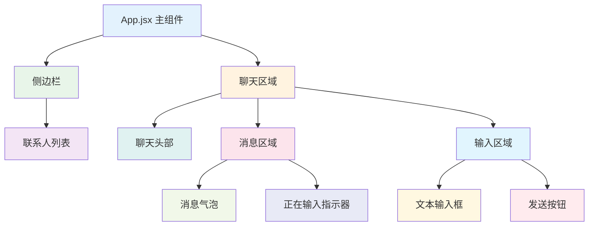
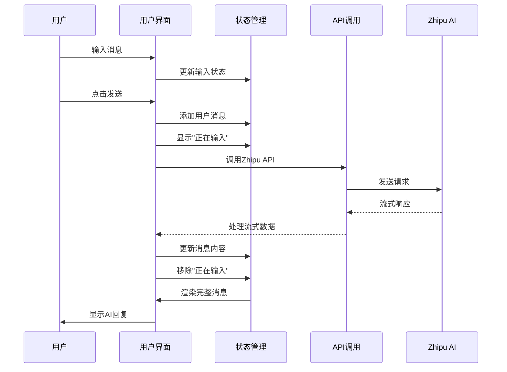

# 聊天应用 (Chat App)

一个基于React和Vite构建的现代聊天应用，具有类似微信的界面风格，支持与AI助手的实时对话功能。

## 项目概述

这是一个功能完整的聊天应用，集成了Zhipu AI的API，实现了与AI助手的智能对话。应用采用了React 19.2.0版本，支持流式响应和Markdown格式的消息渲染。

## 技术栈

- **前端框架**: React 19.2.0
- **构建工具**: Vite 7.2.2
- **UI库**: 自定义CSS样式
- **Markdown渲染**: react-markdown 10.1.0
- **AI集成**: Zhipu AI API

## 功能特性

- 💬 实时聊天界面
- 🤖 AI助手对话支持
- 📝 Markdown格式消息渲染
- 📱 响应式设计，适配移动端和桌面端
- ⚡ 流式API响应，逐字显示AI回复
- 🔄 消息历史记录管理

## 项目结构

```
chat-app/
├── public/              # 静态资源
│   └── vite.svg         # Vite图标
├── src/                 # 源代码
│   ├── App.css          # 应用样式
│   ├── App.jsx          # 主应用组件
│   ├── index.css        # 全局样式
│   └── main.jsx         # 应用入口
├── index.html           # HTML模板
├── package.json         # 项目配置
├── vite.config.js       # Vite配置
└── README.md            # 项目文档
```

## 架构设计

### 整体架构



### 组件架构



### 数据流架构



## 核心模块分析

### 1. 入口模块 (main.jsx)
应用的标准入口点，负责将App组件渲染到DOM中。

### 2. 核心应用组件 (App.jsx)
这是整个应用的核心组件，包含了聊天界面的所有功能和状态管理。

#### 状态管理
- **联系人列表**: 存储聊天联系人信息
- **消息列表**: 存储所有聊天消息
- **当前活动联系人**: 当前选中的联系人
- **输入框内容**: 用户输入的消息内容

#### 核心功能
- **消息发送**: 处理用户发送消息
- **API调用**: 调用Zhipu AI的流式API
- **消息渲染**: 使用ReactMarkdown渲染Markdown格式的消息
- **UI交互**: 处理联系人切换、回车发送等交互

### 3. 样式模块 (App.css)
应用采用了类似微信的UI风格，包含以下样式模块：
- **布局结构**: 侧边栏、聊天区域
- **消息样式**: 消息气泡、Markdown渲染
- **动画效果**: "正在输入"的动画效果
- **响应式设计**: 适配不同屏幕尺寸

## API集成

应用集成了Zhipu AI的API，实现了与AI助手的对话功能：
- 使用流式API (SSE) 实现实时响应
- 支持显示"正在输入"状态
- 实现了消息历史记录传递，保持上下文

## 开发指南

### 安装依赖
```bash
npm install
```

### 开发模式
```bash
npm run dev
```

### 构建生产版本
```bash
npm run build
```

### 代码检查
```bash
npm run lint
```

### GitHub Pages 部署

项目配置了自动化部署，当向main分支推送代码时，会自动构建并部署到GitHub Pages。

部署地址：https://sunbridger.github.io/chat-app/

部署流程：
1. 代码推送到main分支
2. GitHub Actions自动触发构建流程
3. 构建完成后自动部署到GitHub Pages

## 技术亮点

1. **流式API集成**: 实现了类似ChatGPT的逐字显示效果
2. **Markdown支持**: AI助手可以返回格式化的Markdown内容
3. **响应式设计**: 适配移动端和桌面端
4. **用户体验**: 实现了"正在输入"提示、自动滚动等细节

## 改进建议

1. **组件拆分**: 将App.jsx拆分为更小的组件，提高可维护性
2. **状态管理**: 考虑使用Redux或Context API进行全局状态管理
3. **错误处理**: 增强API调用的错误处理和重试机制
4. **功能扩展**: 添加文件上传、语音消息等功能

## 许可证

MIT License

